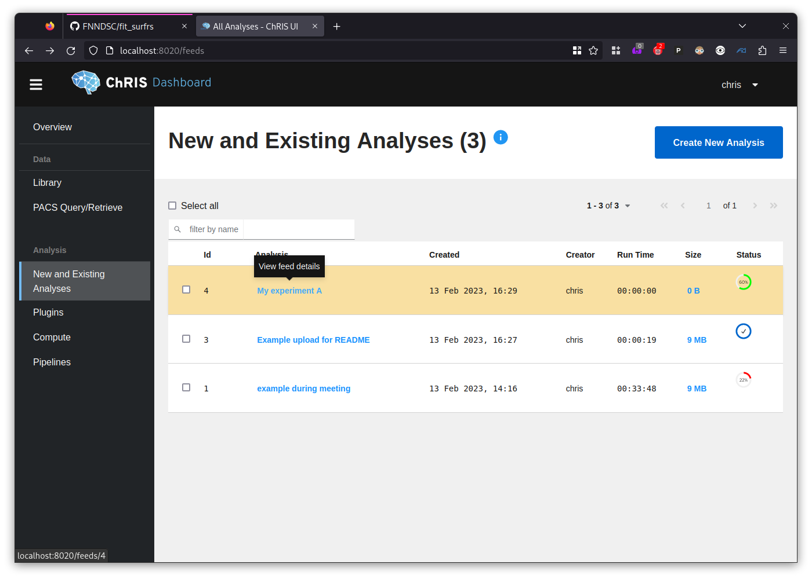
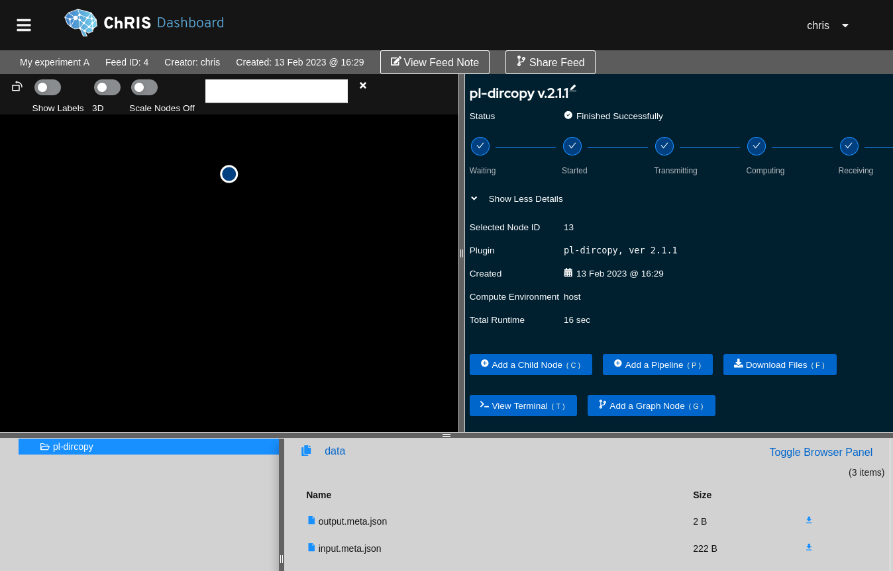

# expand_from_white fetus CP experiment

[](https://hub.docker.com/r/fnndsc/ep-expand_from_white_fetal_parameterized)
[](https://github.com/FNNDSC/ep-expand_from_white_fetal_parameterized/blob/main/LICENSE)
[](https://github.com/FNNDSC/ep-expand_from_white_fetal_parameterized/actions/workflows/ci.yml)

`ep-expand_from_white_fetal_parameterized` is a [_ChRIS_](https://chrisproject.org/)
_ds_ plugin wrapper around a modified `expand_from_white` script from CIVET.

## How to use in _ChRIS_

These instructions are based on ChRIS_ui build 20230209.201+d91ac010
and `chrs` version 0.2.1. The installation instructions for `chrs` are here: https://crates.io/crates/chrs#installation

For FNNDSC Linux logins, `chrs` is pre-installed to `~/arch/Linux64/bin`
and it should already exist in your `$PATH`.

### 1. Log in to _ChRIS_

Assuming your username is `hyukjin.yun`, backend API url is `http://cube-next.tch.harvard.edu/api/v1/`,
and ChRIS_ui URL is `http://chris-next.tch.harvard.edu`. Run:

```shell
chrs login --no-keyring --username 'hyukjin.yun' --address 'http://cube-next.tch.harvard.edu/api/v1/'
```

THe command above will prompt you to type your password.

### 2. Input File Organization

Pairs of laplacian map `.mnc` and starting `.obj` surface files should be found
in subdirectories of the input directory. The brain's hemisphere should be denoted
as part of the path (either in the subdirectory or file name).
Multiple hemispheres and multiple subjects may be given in a single input directory.
For example,

```
experimentA/subj0001-left/laplace.mnc
experimentA/subj0001-left/wm_81920.obj
experimentA/subj0001-right/laplace.mnc
experimentA/subj0001-right/wm_81920.obj
experimentA/subj0002-left/laplace.mnc
experimentA/subj0002-left/wm_81920.obj
experimentA/subj0002-right/laplace.mnc
experimentA/subj0002-right/wm_81920.obj
```

### 3. Input File Upload

These files need to be uploaded to _ChRIS_ using `chrs`:

```shell
chrs upload --feed "My experiment A" experimentA/
```

### 4. Get ID of Uploaded Files

Go to http://chris-next.tch.harvard.edu/feeds and find the analysis
you just created from the `chrs upload` command.



Click on the row to open the feed view. Then click on "Show More Details" in the top-left panel.



Make note of the "Selected Node ID" number which we will use in the next step.

#### 5. Run `ep-expand_from_white_fetal_parameterized`

Parameters about how to run a _ChRIS_ plugin should be passed to `chrs run-latest` before the `--` seperator, and parameters which are to be passed to the plugin itself should be specified after the `--` seperator.

Examples:

```shell
# Run one experiment
chrs run-latest --cpu 80 --memory-limit 500Gi --compute-resource-name ares \
    --previous-id 13 ep-expand_from_white_fetal_parameterized -- \
    --laplacian-weight-coefficient 1.0 --stretch-weight-coefficient 1.0
    
# Run many experiments in parallel, varying the laplacian and stretch weights

lw_array=(0.5 1.0 1.5)
sw_array=(0.5 1.0 1.5)
for lw in "${lw_array[@]}"; do
  for sw in "${sw_array[@]}"; do
    chrs run-latest --cpu 80 --memory-limit 500Gi \
        --compute-resource-name ares \
        --title "surface_fit sw=$sw lw=$lw" \
        --previous-id 13 ep-expand_from_white_fetal_parameterized -- \
        --laplacian-weight-coefficient $lw --stretch-weight-coefficient $sw
  done
done
```

#### 6. Download results

After everything has finished running, it can all be downloaded with a single command:

```shell
chrs download --skip-present 'hyukjin.yun/My experiment A'
```

The format is: `<username>/<feed name>`.

The expected output for the example above where `--title` was given to `chrs run-latest`
would be that the downloaded results will be organized into subdirectories named after
their corresponding titles, e.g.

```
My experiment A/pl-dircopy_13/surface_fit sw=0.5 lw=0.5/data/experimentA/subj0001-left/laplace.obj
My experiment A/pl-dircopy_13/surface_fit sw=0.5 lw=0.5/data/experimentA/subj0001-left/laplace.log
My experiment A/pl-dircopy_13/surface_fit sw=0.5 lw=0.5/data/experimentA/subj0001-left/laplace.rc
My experiment A/pl-dircopy_13/surface_fit sw=0.5 lw=0.5/data/experimentA/subj0001-right/...
My experiment A/pl-dircopy_13/surface_fit sw=1.0 lw=0.5/data/experimentA/subj0001-left/laplace.obj
My experiment A/pl-dircopy_13/surface_fit sw=1.0 lw=0.5/data/experimentA/subj0001-left/laplace.log
My experiment A/pl-dircopy_13/surface_fit sw=1.0 lw=0.5/data/experimentA/subj0001-left/laplace.rc
My experiment A/pl-dircopy_13/surface_fit sw=1.0 lw=0.5/data/experimentA/subj0001-right/...
My experiment A/pl-dircopy_13/surface_fit sw=1.0 lw=0.5/data/experimentA/...
My experiment A/pl-dircopy_13/surface_fit sw=1.5 lw=0.5/data/experimentA/subj0001-left/laplace.obj
My experiment A/pl-dircopy_13/surface_fit sw=1.5 lw=0.5/data/experimentA/...
My experiment A/pl-dircopy_13/surface_fit sw=1.5 lw=0.5/data/...
My experiment A/pl-dircopy_13/surface_fit sw=0.5 lw=1.0/...
My experiment A/pl-dircopy_13/surface_fit sw=1.0 lw=1.0/...
```

##### 6.1. Troubleshooting Downloads

If you get the error "Connection reset by peer (os error 104)"
simply rerun `chrs download --skip-present ...`
